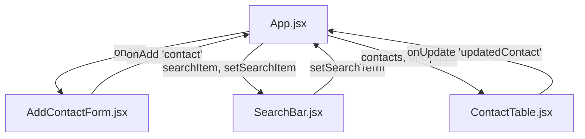

```mermaid
flowchart TD
  App[App.jsx] -->|onAdd| ACF[AddContactForm.jsx]
  ACF -->|onAdd 'contact'| App
  App -->|searchItem, setSearchItem|SB[SearchBar.jsx]
  SB -->|setSearchTerm|App
  App -->|contacts, onUpdate|CT[ContactTable.jsx]
  CT -->|onUpdate 'updatedContact'|App
```
# Patterns
1. Container–Presentational Pattern
2. Unidirectional Data Flow
3. Controlled Components Pattern
4. Lifting State Up
